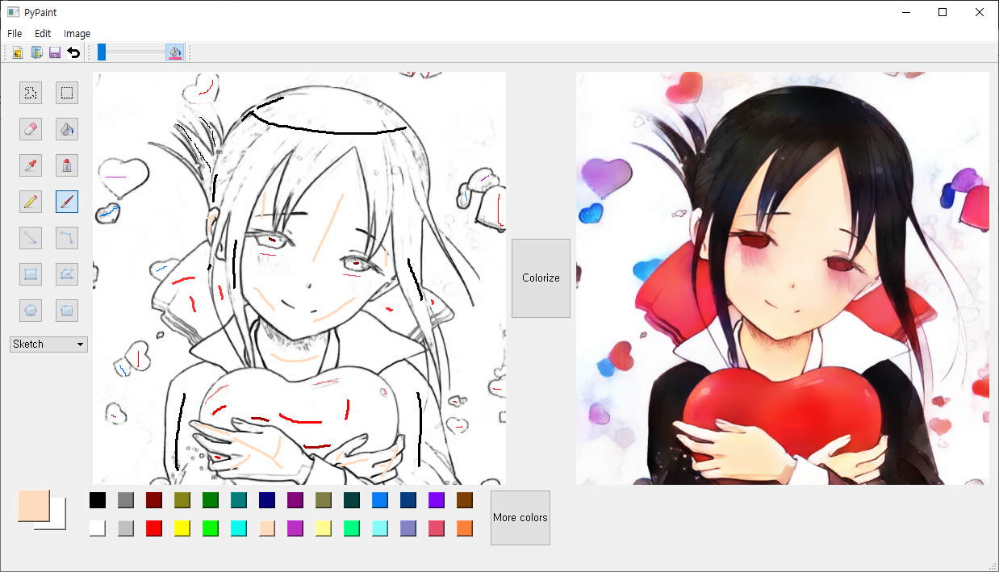
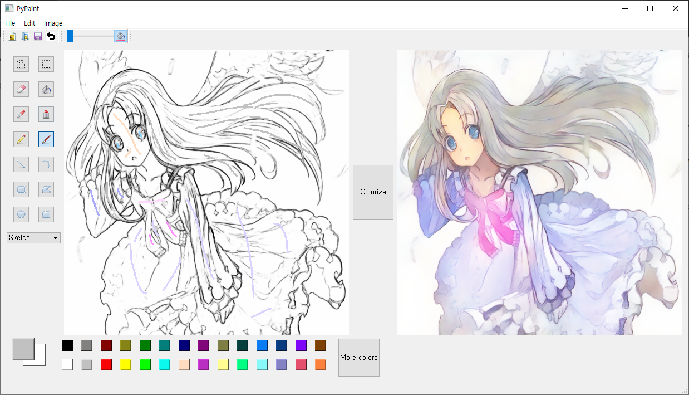

# Anime-Colorization-Machine

User-interactive anime colorization

Prerequisites
------

  `pytorch`
  
  `torchvision`
  
  `numpy`
  
  `openCV2`
  
  `opencv_transforms` (For training) (You can simply install this by `pip install opencv_transforms`)
  
  `matplotlib` (For training)
  
Results
-----
[Demo video](https://youtu.be/hqbMoQiCGN0)

1. Grayscale to color

2. Sketch to color

    
Dataset
------

  1. Taebum Kim, "Anime Sketch Colorization Pair", https://www.kaggle.com/ktaebum/anime-sketch-colorization-pair
  
  2. 68K illustrations crawled from web
  
    
Usage
------

  1. Download model weight from here() and unzip on `src/model/checkpoint`
  2. `python main.py`
  3. Select `Grayscale` or `Sketch` mode
  4. Open image and draw
  
Training details
------

| 
Parameter
 | 
Value
 |
|:--------|:--------:|
| Learning rate | 2e-4 | 
| Batch size | 2 | 
| Iteration | 150K | 
| Optimizer | Adam |
| (beta1, beta2) | (0.5, 0.999) |
| Data Augmentation | RandomResizedCrop(512) RandomHorizontalFlip() |
| HW | CPU : Intel i5-8400 RAM : 16G GPU : NVIDIA GTX1060 6G |
| Training Time | About 1.37s per iteration (About 50 hours for 150K iterations) |
